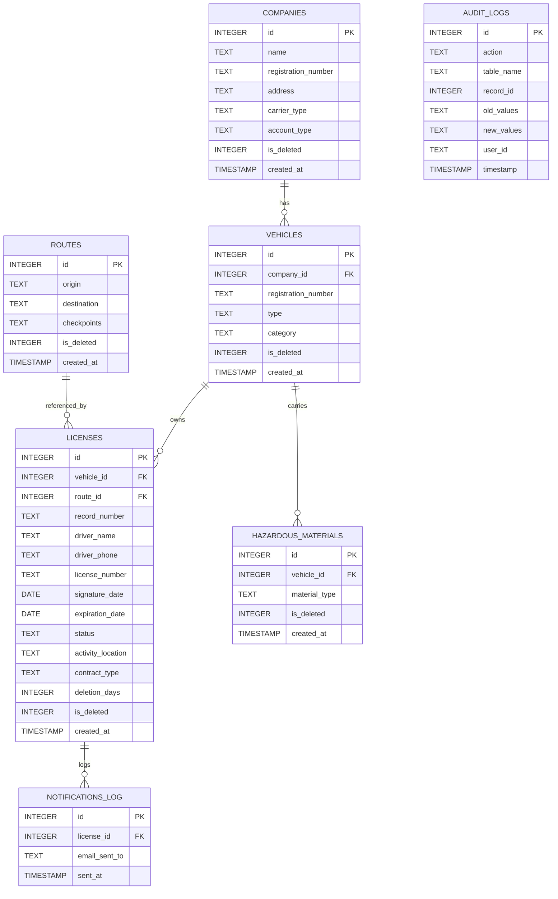

## Database Design (ER Diagram First)

**Schema explanation:**

- `companies` stores carrier metadata; `vehicles` links to a company via `company_id`.
- `routes` is lightweight and referenced by `licenses.route_id`.
- `licenses` is the primary contract entity (business license/contract). It joins `vehicles` and `routes` and contains driver and status fields.
- `hazardous_materials` maps vehicle -> material_type; useful for regulation checks.
- `audit_logs` records create/update/delete/restore operations for compliance and traceability.
- `notifications_log` records outgoing notification events.

**Constraints & indices (from schema):**

- Unique indexes: `registration_number` on vehicles, `record_number` and `license_number` on licenses, `registration_number` on companies may be unique.
- Foreign keys: `vehicle_id` -> `vehicles.id`, `company_id` -> `companies.id`, `route_id` -> `routes.id`.
- Soft delete: `is_deleted` + `deleted_at` on core tables supports reversible deletes.

These design choices favor an offline-first, single-file DB with auditability and easy querying for the desktop administrative app.

# Database Design

## 1. Storage Model

- Engine: SQLite.
- Primary file: `database/licenses.db`.
- Schema source: `database/schema_definitions.sql`.
- Access layer: `database/connection_handler.py`.

The storage strategy is intentionally local-first. It optimizes for operational simplicity, offline use, and zero external infrastructure dependencies.

## 2. Entity Inventory

### 2.1 companies

Purpose:

- Stores carrier identity and classification.

Key fields:

- `id` primary key.
- `name` required company name.
- `registration_number` unique when provided.
- `carrier_type` and `account_type` for business classification.
- `is_deleted`, `deleted_at`, `created_at` lifecycle fields.

### 2.2 vehicles

Purpose:

- Stores transport assets attached to companies.

Key fields:

- `company_id` foreign key to `companies`.
- `registration_number` unique required vehicle identifier.
- `type`, `category` descriptors.
- Soft-delete lifecycle fields.

### 2.3 routes

Purpose:

- Captures origin/destination and optional checkpoints for transport paths.

Key fields:

- `origin`, `destination` required.
- `checkpoints` optional text payload.
- Soft-delete lifecycle fields.

### 2.4 licenses

Purpose:

- Central contract record for transport compliance.

Key fields:

- `vehicle_id` foreign key to vehicle.
- `route_id` optional foreign key to route.
- `record_number` unique required operational identifier.
- `license_number` unique required driver-license identifier.
- `signature_date`, `expiration_date`, and `status` lifecycle controls.
- `activity_location`, `contract_type`, `deletion_days` operational metadata.
- Soft-delete lifecycle fields.

### 2.5 hazardous_materials

Purpose:

- Records hazardous material type associations for vehicles.

Key fields:

- `vehicle_id` foreign key.
- `material_type` required.
- Soft-delete lifecycle fields.

### 2.6 audit_logs

Purpose:

- Immutable operational trace of data mutations.

Key fields:

- `action`, `table_name`, `record_id` identify the change.
- `old_values`, `new_values` capture snapshots (JSON payloads where available).
- `user_id` and timestamp provide accountability.

### 2.7 settings

Purpose:

- Key-value runtime configuration store.

Key fields:

- `key` unique identifier.
- `value` text content.
- `updated_at` timestamp.

### 2.8 notifications_log

Purpose:

- Records outbound expiration notifications.

Key fields:

- `license_id` foreign key.
- `email_sent_to` recipient.
- `sent_at` timestamp.

## 3. Relationship Model

- One company can own many vehicles.
- One vehicle can have many licenses over time.
- One vehicle can have many hazardous material entries.
- One route can be attached to many licenses.
- One license can produce many notification log entries.

This model prevents denormalized repetition and keeps update behavior consistent.

## 4. Soft-Delete Strategy

Operational tables retain deleted records using:

- `is_deleted` as a boolean-like integer marker.
- `deleted_at` as a timestamp.

Why it exists:

- Compliance workflows require recoverability.
- Audit and historical analytics should not be broken by hard deletes.

Consequences if removed:

- Accidental deletions would become irreversible.
- Historical reporting and forensic traceability would degrade.

## 5. Constraints and Integrity

- Unique constraints protect identity fields.
- Foreign keys enforce relational validity.
- Required fields guard against incomplete records.

Connection-level safeguards:

- `PRAGMA foreign_keys=ON`.
- WAL mode for better read concurrency.
- busy timeout to handle transient write contention.

## 6. Indexing Decisions

The schema includes targeted indexes to support common workflows:

- `licenses(license_number)` for quick license lookup.
- `licenses(expiration_date)` for scheduler and expiry views.
- `licenses(status)` for active/inactive filtering.
- `licenses(activity_location)` for municipality analysis.
- `vehicles(registration_number)` for vehicle search.
- `vehicles(company_id)` for relational joins.
- `companies(name)` for company search.
- `hazardous_materials(vehicle_id)` for vehicle-linked material lookups.
- `audit_logs(table_name, record_id)` for trace investigations.

These indexes are selected to accelerate real user queries rather than exhaustive indexing of every column.

## 7. Migration and Compatibility Strategy

On application startup, the database layer:

- Applies base schema if missing.
- Runs conditional column-add migrations.
- Preserves compatibility with older DB files.

Why this strategy exists:

- Desktop deployments often keep long-lived database files.
- Startup migrations avoid manual migration steps for users.

## 8. Query Patterns

### 8.1 Listing and Search

- Paginated listing with constrained page size.
- Search across key contract and related entity fields.
- Controlled sorting for deterministic navigation.

### 8.2 Deleted Data Access

- Separate deleted-contract query path to preserve active view clarity.
- Restore path gated by business-rule checks.

### 8.3 Statistics

- Aggregations by status and carrier type.
- Time-windowed activity metrics.
- Municipality-level grouping for location analysis.

## 9. Audit Model

Mutating operations write audit records for create, update, delete, and restore actions.

Why this matters:

- Enables operational accountability.
- Supports compliance inspections and post-incident analysis.
- Preserves context beyond the current row state.

## 10. Backup and Recovery

- Backup files are timestamped and stored under `database/backups`.
- Recovery is file-based and operationally simple.

This approach is suitable for a local desktop system and lowers recovery complexity for non-DBA operators.

## 11. References

- [System Overview](system_overview.md)
- [System Architecture](system_architecture.md)
- [Performance Optimization](performance_optimization.md)
- [Error Handling and Validation](error_handling_and_validation.md)
