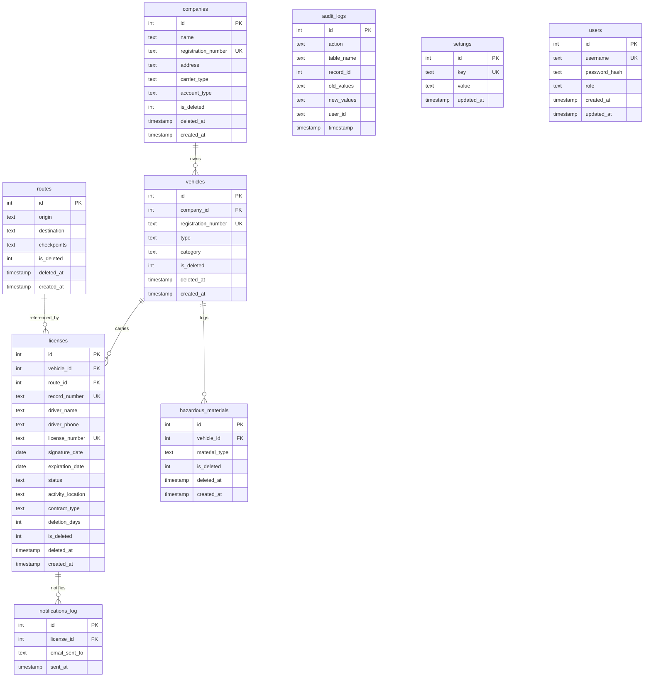

# Database Design

This database is a single-file SQLite deployment with the schema defined in `database/schema_definitions.sql` and accessed only through `database/connection_handler.py`. The design is intentionally local-first: it favors easy deployment, small operational burden, and predictable behavior on a desktop machine over distributed scale.

## 1. ER Diagram

### Diagram

### Mermaid source

### Explanation

- `companies` stores carrier identity and classification. It exists so the same company record can be shared across many vehicles and contracts. If it were removed, company names and registration numbers would be repeated inside each license record, making updates brittle.
- `vehicles` stores transport assets and ties them to a company through `company_id`. The `registration_number` unique constraint prevents duplicate vehicles. If this table were missing, the system would lose the ability to distinguish which contract belongs to which truck or trailer.
- `routes` captures origin, destination, and optional checkpoints. It exists because route details are not identical to company or vehicle details and can be reused by many licenses. Without it, route metadata would be copied into each contract row and become harder to normalize.
- `licenses` is the central compliance record. It references a vehicle and optionally a route, stores contract numbers, driver data, dates, activity location, contract type, and soft-delete state. If this table disappeared, the system would no longer have a single operational record to search, renew, suspend, or restore.
- `hazardous_materials` records the material type attached to a vehicle. The code treats this as optional, so the relationship is separate instead of mandatory. If it were merged into the vehicle table, the model would become less flexible for vehicles that carry multiple material types over time.
- `audit_logs` is the immutable change trail. It captures action, table name, record id, and before/after snapshots when available. If it were removed, maintainers would lose a key compliance and troubleshooting tool.
- `settings` is a key-value runtime configuration table. It stores SMTP, backup, and default-admin bootstrap values without requiring schema changes for every new knob. If it were replaced with hardcoded settings, the app would become far less configurable for local operators.
- `users` stores authentication records with hashed passwords and role labels. It exists because the desktop shell still needs a real login gate even though the app is local. Without it, every operator would have direct access to the system at startup.
- `notifications_log` records who received an expiration alert for which license. If it were missing, email delivery would be difficult to audit after the fact.

## 2. Schema Rules

The schema relies on a small set of explicit integrity rules:

- Primary keys are integer autoincrement identifiers on every table.
- Foreign keys connect `vehicles.company_id` to `companies.id`, `licenses.vehicle_id` to `vehicles.id`, `licenses.route_id` to `routes.id`, `hazardous_materials.vehicle_id` to `vehicles.id`, and `notifications_log.license_id` to `licenses.id`.
- Unique constraints protect `companies.registration_number`, `vehicles.registration_number`, `licenses.record_number`, `licenses.license_number`, `settings.key`, and `users.username`.
- Required columns keep the data usable for the UI and the scheduler: for example `companies.name`, `vehicles.registration_number`, `licenses.record_number`, `licenses.license_number`, `licenses.vehicle_id`, and `hazardous_materials.material_type` cannot be empty.

These rules matter because the application is built around searchable operational records. If uniqueness or referential integrity were relaxed, the search, restore, and statistics flows would return ambiguous or invalid rows.

## 3. Indices

The base schema and the migration layer create indexes that match the actual query patterns in the code:

- `licenses(license_number)` supports direct contract lookup and duplicate checking.
- `licenses(expiration_date)` supports expiry views and scheduler scans.
- `licenses(status)` supports active/expired filtering.
- `licenses(activity_location)` supports municipality analysis and search filtering.
- `vehicles(registration_number)` supports vehicle lookup from search and creation paths.
- `vehicles(company_id)` supports company-to-vehicle joins.
- `companies(name)` supports company lookup and duplicate prevention.
- `hazardous_materials(vehicle_id)` supports vehicle-linked hazmat lookup.
- `audit_logs(table_name, record_id)` supports trace inspection.
- Startup migrations also add `licenses(driver_name)`, `licenses(activity_location)`, and `licenses(contract_type)` indexes for the current UI filters.

The code intentionally does not index every column. These are workload-driven indexes, not blanket optimization.

## 4. Soft-Delete and Restore Model

The operational tables `companies`, `vehicles`, `routes`, `licenses`, and `hazardous_materials` all use `is_deleted` and `deleted_at` instead of hard deletion.

Why this exists:

- The system needs recoverability for accidental deletions.
- Historical reporting should still see deleted records when appropriate.
- The restore flow in the UI depends on records remaining in place.

What would happen without it:

- Records could not be restored without manual SQL surgery.
- Audit trails would become much less useful.
- Search behavior would lose the clear distinction between active and archived contracts.

The deletion implementation in `database/connection_handler.py` cascades soft-deletes from company to vehicles, licenses, and hazardous materials. That preserves data while keeping the active views clean.

## 5. Migrations and Compatibility

The connection layer bootstraps the schema from `schema_definitions.sql` and then runs compatibility migrations for older database files. It adds missing columns if needed and removes the legacy `hazardous_materials.quantity` column when found.

This strategy is appropriate for a desktop app because the database file can live for a long time on the operator’s machine. A destructive rebuild would be risky, but a non-destructive migration path lets the app evolve while preserving local data.

## 6. Backup Strategy

`services/background_job_manager.py` performs periodic file copies of the SQLite database into `database/backups/`.

Why this works for the current system:

- Backups are simple and fast because SQLite is a single file.
- The app does not require external backup infrastructure.
- Recovery is straightforward for non-DBA operators.

The trade-off is that backup scheduling is intentionally lightweight rather than enterprise-grade. That is acceptable here because the deployment target is a local desktop machine.

## 7. Query Patterns and Consequences

- Listing and search use joins across licenses, vehicles, and companies so the UI can show a human-readable row without extra round trips.
- The deleted-record path uses the same joins but filters `is_deleted=1`, which keeps active and archived views separate.
- Statistics queries aggregate counts by carrier type, municipality, status, and expiry window; that is why the cache exists in `StatisticsService` and in `Database`.
- Notifications are logged into `notifications_log` so the expiry scheduler can prove that alerts were sent.

If these query patterns were changed to denormalized or uncontrolled access, the search and dashboard code would become less deterministic and harder to maintain.

## 8. Assumptions

- `audit_logs.user_id` is free-text rather than a foreign key, so the log can record system actions as well as user actions.
- SMTP credentials are stored in `settings` as plain text because the code currently treats settings as a local runtime store.
- The base schema and the migration layer are intentionally both documented because the live database may contain either shape depending on when the user first ran the app.

## 9. References

- [System Architecture](system_architecture.md)
- [System Flows](system_flows.md)
- [Project Structure Guide](project_structure_guide.md)
