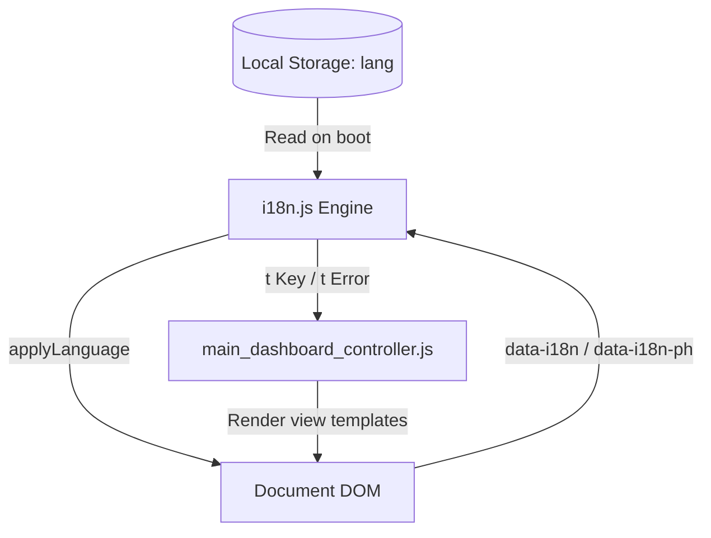

# Localization & Internationalization (i18n) Architecture

This document describes the internationalization (i18n), localization, and RTL (Right-to-Left) styling architecture implemented in the **Hazardous Material Transport License Management System**.

---

## 1. Localization Architecture

The localization system is built to decouple structural UI templates from user-visible language strings. It is fully run-time client-side driven, meaning no component reloading or Electron restarts are necessary to change the application language.

### Core Architecture Components



1. **`i18n.js` (Central Engine):** Houses the global `TRANSLATIONS` dictionary, current state management, and language switching helper routines.
2. **`main_dashboard_controller.js` (UI Driver):** Builds template HTML structures dynamically. It resolves labels at render-time using inline `t(key)` calls and calls `applyLanguageToContainer()` when raw external subpage fragments are injected.
3. **`localStorage` (Persistence):** Holds the user's selected language (`ar`, `fr`, or `en`).

---

## 2. Translation System Structure

Translations are defined as flat key-value pairs grouped by language code inside `TRANSLATIONS`:

```javascript
const TRANSLATIONS = {
  en: {
    dir: "ltr",
    nav_dashboard: "Dashboard",
    // ...
  },
  fr: {
    dir: "ltr",
    nav_dashboard: "Tableau de bord",
    // ...
  },
  ar: {
    dir: "rtl",
    nav_dashboard: "لوحة التحكم",
    // ...
  }
};
```

### Key Retrieval & Fallback Strategy

* **The `t(key)` Helper:** Looks up the key under the selected language (`currentLang`). If the key is not defined in the chosen language, it falls back to the English (`en`) translation. If the key is absent in English as well, it returns the key string itself to prevent blank labels.
* **The `translateError(msg)` Helper:** Translates backend exception messages. Since Python backend errors (e.g. SQLite constraints or business rules) are returned in English, `translateError` intercepts them, maps them via a predefined dictionary, and outputs the localized counterpart.

---

## 3. Directionality & RTL Support (Arabic)

For Arabic, the application changes text and layout flow to Right-to-Left (RTL) naturally and correctly.

### Layout Implementation

1. **HTML & Body Attributes:**
   On language change, `applyLanguage()` updates the attributes:
   ```javascript
   document.documentElement.lang = currentLang;
   document.documentElement.dir = tr.dir;
   document.body.dir = tr.dir;
   ```
2. **CSS Logical Rules:**
   Layout properties are styled using modern CSS properties such as `inset-inline-start`, `padding-inline-start`, and logical alignments, ensuring the sidebar flips to the right and page contents flip to the left automatically.
3. **Form Elements Alignment:**
   A custom override in `style.css` ensures `<select>` dropdown arrows and paddings are inverted correctly under RTL:
   ```css
   [dir="rtl"] select.form-control {
     background-position: left 10px center;
     padding-right: 12px;
     padding-left: 30px;
   }
   ```
4. **Icons and Alignments:**
   Sidebars and form alignments maintain natural layouts where numbers, checkboxes, inputs, and button grids align to the right margins under RTL direction.

---

## 4. How Language Switching Works

### 1. User Action
When a user clicks a language option in the dropdown selector:
```javascript
setLanguage('ar');
```

### 2. State & Storage Update
`setLanguage` sets the active key, writes it to `localStorage` (so it persists across app restarts), and calls `applyLanguage()`.

### 3. DOM Traversal
`applyLanguage()` updates document direction, changes window title, and executes a full search of elements containing `data-i18n` and `data-i18n-ph` attributes:
* Elements with `placeholder` attributes get their placeholder translated.
* Other elements have their `textContent` replaced.

### 4. Dynamic Pages Lifecycle
`applyLanguage()` dispatches a custom `langchange` event. The main dashboard controller intercepts this event to re-render the active page template dynamically:
```javascript
document.dispatchEvent(new Event("langchange"));
```

---

## 5. Chart Localization

The application uses **Chart.js** for statistics rendering. When the language switches:
1. All charts are destroyed to clear memory and canvas bindings.
2. New Chart instances are generated.
3. Labels, legends, tooltips, and axis numbers are translated using `t()` before the chart compiles, ensuring chart tooltips like `Total: 10 (100%)` are completely translated.

---

## 6. Future Language Expansion Strategy

To add a new language (e.g., Spanish `es`):
1. **Define the Language Section:**
   Add a new language block in `TRANSLATIONS` inside [i18n.js](file:///c:/Users/Raouf/Downloads/hazmate-main-main/hazmate-main-main/frontend/js/i18n.js) with `dir: "ltr"` (or `rtl` if applicable) and translate all existing keys.
2. **Update the Selectors:**
   Add options in the language selector menus in [index.html](file:///c:/Users/Raouf/Downloads/hazmate-main-main/hazmate-main-main/frontend/index.html) and [login.html](file:///c:/Users/Raouf/Downloads/hazmate-main-main/hazmate-main-main/frontend/pages/login.html):
   ```html
   <div class="lang-option" data-lang="es" role="menuitem">🇪🇸 Español</div>
   ```
3. **Verify:**
   Test direction, layout constraints, forms, and alerts to verify complete localization.
