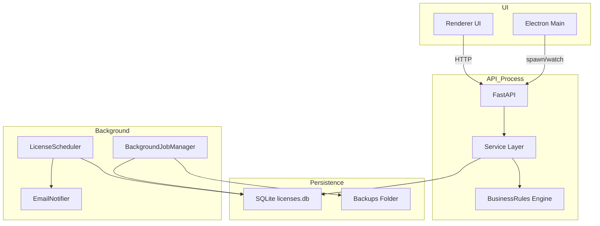
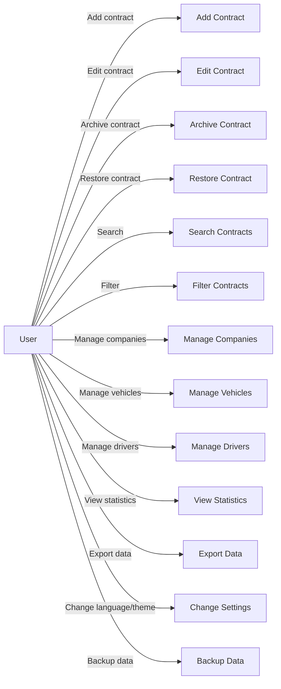
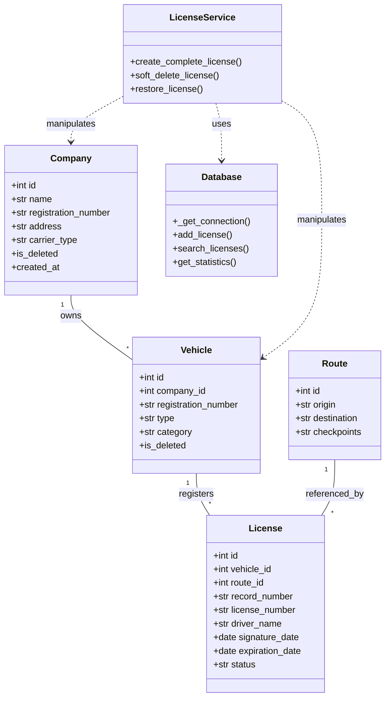

## System Architecture (Diagram First)


```mermaid
graph LR
  subgraph Desktop
    A[Electron Main] -->|IPC| B[Renderer UI]
    B -->|HTTP requests| C[Local API (FastAPI)]
  end

  subgraph Backend
    C --> D[Service Layer]
    D --> E[Database (SQLite licenses.db)]
    D --> F[StatisticsService (in-memory cache)]
    D --> G[Notifications (EmailNotifier / Scheduler)]
    D --> H[BackgroundJobManager (backups)]
  end

  subgraph Modules
    I[LicenseService (Contract Management)]
    J[Search / Query Layer]
    K[Company Management]
    L[Vehicle Management]
    M[Route Management]
    N[Hazmat Management]
  end

  C --> I
  I --> E
  J --> E
  K --> E
  L --> E
  M --> E
  N --> E
  G --> E
  H --> E
  F --> E

  style E fill:#f9f,stroke:#333,stroke-width:1px
  style B fill:#cff,stroke:#333,stroke-width:1px
  style C fill:#cfc,stroke:#333,stroke-width:1px
```

**Explanation:**

- **Electron Main & Renderer (UI):** The desktop application ships with an Electron shell. The renderer (frontend) is a web UI that issues HTTP calls to a local FastAPI process and uses IPC with the Electron main process for lifecycle coordination (startup ping). Without the Electron UI the system would lose the desktop distribution model and local offline UX.

- **Local API (FastAPI):** Serves as the programmatic boundary. It exposes endpoints for licenses, companies, vehicles, statistics, and settings. Keeping a local HTTP API decouples UI presentation from business logic and allows background processes to reuse the same interfaces.

- **Service Layer (LicenseService, BusinessRules):** Orchestrates multi-step operations (create license -> company/vehicle/route/hazmat -> license record). It protects invariants and centralizes auditing.

- **Database (SQLite):** Single-file local database (licenses.db) managed by `Database` class. Chosen for offline-first, single-user desktop apps; supports WAL and retry logic to reduce contention.

- **StatisticsService:** Provides cached analytics to speed up dashboard rendering. It reduces heavy join queries for frequent reads.

- **Notifications & Scheduler:** `LicenseScheduler` runs in background threads, checks for expiring licenses, and uses `EmailNotifier` to send alerts and log them.

- **BackgroundJobManager / Backups:** Periodic backups copy the database file to backups/ to preserve local data.

This topology matches a desktop administrative application: UI + local API + file-backed DB + background workers. Each component enforces separation of concerns and aids local reliability.

# System Architecture

## 1. Architectural Style

The system follows a local N-tier desktop architecture with explicit process and layer boundaries.

### 1.1 Presentation Layer

- Electron renderer with HTML/CSS/JavaScript UI.
- Handles user interaction, page rendering, and local state.

### 1.2 Desktop Orchestration Layer

- Electron main process manages application lifecycle.
- Starts backend subprocess when needed.
- Performs backend health checks before exposing the main UI.

### 1.3 API and Domain Layer

- FastAPI endpoints receive and validate requests.
- Services orchestrate domain workflows.
- Business rules engine enforces policy constraints.

### 1.4 Persistence Layer

- SQLite database with schema bootstrap and migration logic.
- Query helpers, lock retry, and caching invalidation implemented in the data access layer.

## 2. Topology Overview

```text
Electron Renderer (frontend)
	-> HTTP calls via API client
Electron Main Process
	-> starts/watches Python API process
FastAPI Application
	-> service orchestration
Database Layer
	-> SQLite file and backups
```

This topology is designed for local robustness, not distributed scale.

## 3. Startup and Readiness

1. Electron starts from root `package.json` scripts.
2. Main process probes `http://127.0.0.1:5757/api/ping`.
3. If unavailable, Python process is spawned with `backend/api/api_endpoint_manager.py`.
4. Main process waits until backend responds healthy.
5. Browser window opens `frontend/index.html`.

Why this startup strategy exists:

- It removes the need for users to start backend manually.
- It prevents blank UI states caused by unavailable API.
- It gives deterministic app boot behavior for support and diagnostics.

## 4. Request/Response Data Flow

1. Renderer calls `frontend/js/frontend_api_client.js`.
2. Request reaches FastAPI route in `backend/api/api_endpoint_manager.py`.
3. Pydantic validates request data and query parameters.
4. API delegates to services and/or data access methods.
5. Database query runs with SQLite retry and timeout settings.
6. API returns normalized JSON to the renderer.
7. Renderer updates UI state and feedback elements.

## 5. Domain Processing Model

### 5.1 Contract-Oriented Orchestration

License creation is multi-entity by design:

- Validate business constraints.
- Resolve/create company.
- Resolve/create vehicle.
- Create route and optional hazardous material rows.
- Create license record.
- Write audit log.

This protects consistency across normalized entities.

### 5.2 Analytics Path

- Statistics endpoint delegates to `StatisticsService`.
- Cached responses are used for repeat dashboard requests.
- Cache invalidates on relevant mutations.

### 5.3 Notification Path

- Scheduler periodically checks for soon-to-expire licenses.
- SMTP notifier sends configured alerts.
- Notification attempts are logged for traceability.

## 6. Background Architecture

- `LicenseScheduler`: daemon thread with periodic expiration checks.
- `BackgroundJobManager`: async backup loop and helper jobs.
- FastAPI lifespan events start and stop both components.

Why this matters:

- Background jobs must persist independently of page navigation.
- Request handling must remain responsive while maintenance jobs run.

## 7. Reliability and Safety Mechanisms

- Soft-delete strategy for recoverable deletions.
- Immutable audit logging for operational traceability.
- SQLite WAL mode and lock retry for desktop concurrency.
- Centralized API exception handling for predictable errors.

## 8. Legacy Isolation Strategy

Legacy PyQt assets are retained under `modules/legacy_pyqt_ui` and excluded from active runtime behavior.

Why they are kept:

- Historical reference and migration traceability.
- Zero impact on current architecture because they are not in the runtime path.

## 9. Architectural Trade-offs

- Local-first architecture intentionally favors operational simplicity over multi-user horizontal scale.
- SQLite is appropriate for local workloads but is not a distributed transactional store.
- Service-oriented Python backend adds process complexity but significantly improves code organization and maintainability.

## 10. References

- [System Overview](system_overview.md)
- [Database Design](database_design.md)
- [Backend Design](backend_design.md)
- [Deployment and Runtime](deployment_and_runtime.md)

## 11. Component Diagram (visual + explanation)




Explanation: The component diagram isolates runtime processes and responsibilities: the renderer and Electron host the UI; the API process hosts the FastAPI app, services and business rules; persistence is the SQLite file plus backups; background components handle scheduled checks and backups. Removing the `Service Layer` would force the API to implement orchestration and increase coupling between endpoints.

## 12. Use Case Diagram (visual + explanation)




Explanation: The use cases reflect supported UI operations visible in the frontend and API endpoints. Each operation maps to one or more routes (e.g., add/edit/archive/restore map to `/api/licenses` endpoints). Omitting logging or audit features would reduce traceability for compliance.

## 13. Class Diagram (visual + explanation)




Explanation: The class diagram maps DB tables to domain objects and shows service-level dependencies. `LicenseService` depends on `Database` for persistence and manipulates `Company`/`Vehicle` domain entities. Without a `LicenseService` the `API` would need to coordinate multiple DB calls and the auditing/restore policies would scatter across endpoints.
