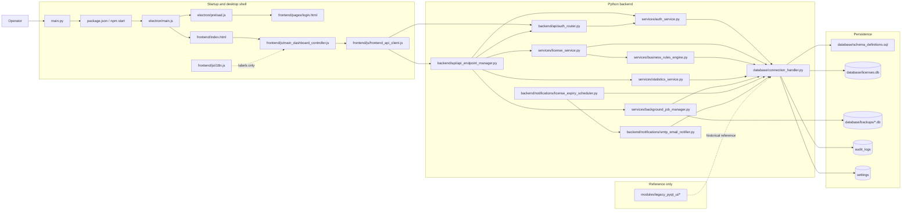
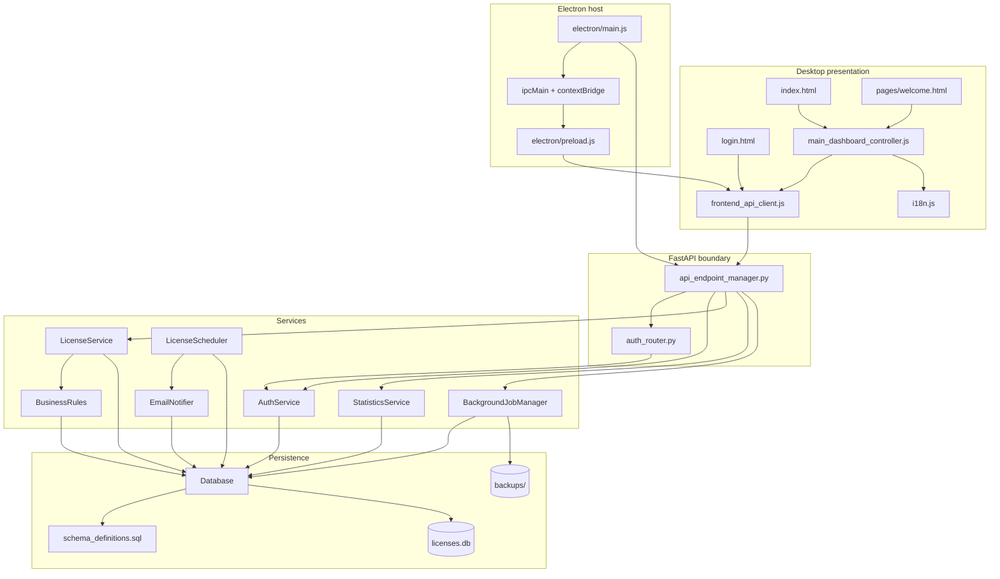
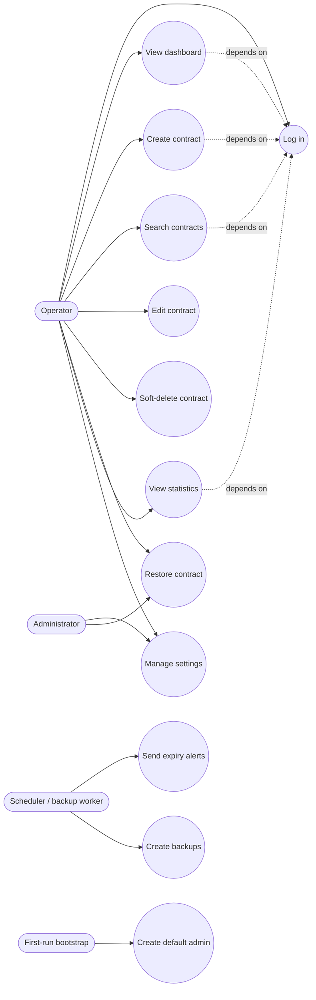
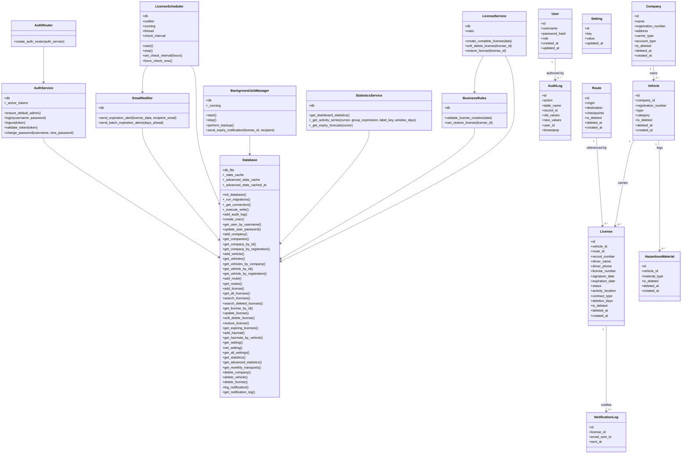

# System Architecture

This repository implements a local desktop administration system, not a web SaaS product. The actual runtime is a small Electron shell that launches a Python FastAPI process, which in turn talks to a single SQLite database file through a thin data-access wrapper. The source code also contains a legacy PyQt UI under `modules/legacy_pyqt_ui`, but that code is retained as reference material rather than part of the active runtime path.

## Discovered additions

- `backend/api/auth_router.py` and `services/auth_service.py` provide the login/session flow that is active in the desktop shell.
- `frontend/pages/welcome.html` is a landing screen that sits between login and the main dashboard.
- `renderSettings()`, `renderDeletedContracts()`, and the restore flow are active in the current JavaScript UI even though they were not included in the initial file list.
- `main.py` is a thin wrapper that launches `npm start`; it is the user-facing bootstrap entry point.

## 1. System Architecture Diagram

### Diagram

### Mermaid source

### Explanation

- `main.py` exists as the top-level launcher, and `package.json` routes that launch into Electron. If this wrapper were absent, the project would no longer present as a single desktop application entry point.
- `electron/main.js` owns process supervision: it starts Python, polls `/api/ping`, and only then opens the browser window. That startup gate matters because the renderer expects a live API immediately. Without it, the UI would race the backend and fail on first load.
- The renderer side is split into `login.html`, `index.html`, `main_dashboard_controller.js`, `frontend_api_client.js`, and `i18n.js`. Those pieces exist so the UI can be display-only, localized, and decoupled from backend transport details. If the API client were scattered across pages, each view would need to know request formatting and error parsing.
- `backend/api/api_endpoint_manager.py` is the HTTP boundary. It receives requests, validates payloads, and delegates work to services instead of mutating the database directly. `auth_router.py` is separate so authentication can be isolated from the rest of the REST surface without circular imports.
- `services/license_service.py` exists because contract creation touches several tables in one unit of work. `services/business_rules_engine.py` exists so those rules can be changed without rewriting endpoints. If the orchestration layer were removed, the API would have to duplicate the company/vehicle/route/license sequence in multiple places.
- `services/statistics_service.py` exists because dashboard aggregation is read-heavy and benefits from caching. `services/background_job_manager.py`, `license_expiry_scheduler.py`, and `smtp_email_notifier.py` exist so backups and email alerts can run independently of user navigation. If those jobs were embedded in request handlers, long-running maintenance work would block the UI.
- `database/connection_handler.py` exists as the single SQLite access boundary. It owns WAL mode, busy-timeout retries, schema bootstrap, migrations, cache invalidation, and audit logging. If callers touched SQLite directly, the app would lose consistency and each feature would need to rediscover the same concurrency and schema rules.
- `database/schema_definitions.sql` exists as the canonical schema source. `database/licenses.db` is the actual local data store, while `database/backups/*.db` is the recovery path. If backups were missing, a desktop operator could not recover easily from accidental deletion or corruption.
- `modules/legacy_pyqt_ui/*` is retained only as a historical reference. It is shown in the diagram because it informs the project history, but it does not participate in current request flow.

## 2. Component Diagram

### Diagram

### Mermaid source

### Explanation

- The presentation components exist to keep the desktop shell understandable: `login.html` handles sign-in, `index.html` hosts the authenticated shell, `welcome.html` provides a landing page, `main_dashboard_controller.js` controls navigation and page rendering, `frontend_api_client.js` centralizes HTTP calls, and `i18n.js` manages translated strings. If any of those were missing, the UI would either become monolithic or leak backend concerns into page code.
- `electron/main.js` and `electron/preload.js` form the host boundary. `main.js` starts the backend and supervises readiness; `preload.js` exposes only the minimum bridge needed by the renderer. This keeps Node APIs out of the page context, which is important for safety and predictability in a local app.
- `api_endpoint_manager.py` and `auth_router.py` are the HTTP façade. They exist so the renderer never talks to SQLite directly and never needs to know service internals. If the renderer were allowed to access persistence directly, the browser-style UI would be tightly coupled to the schema and unable to reuse the business rules layer.
- `AuthService`, `LicenseService`, `BusinessRules`, `StatisticsService`, `BackgroundJobManager`, `LicenseScheduler`, and `EmailNotifier` are separated by responsibility. That separation matters because login/session logic, contract orchestration, analytics, backups, and alerting fail differently and must be maintained independently.
- `Database`, `schema_definitions.sql`, `licenses.db`, and the backup folder form the persistence component. The schema file is the source of truth, the database file is the live state, and the backup directory is the recovery path. If this component disappeared, every higher layer would lose durable storage.
- The component map fits a local desktop administrative app because it minimizes network dependencies, keeps the main user path responsive, and makes operational work such as backups and notifications self-contained.

## 3. Use Case Diagram

### Diagram

### Mermaid source

### Explanation

- `Operator` is the main human user of the system. The active UI lets that user log in, view the dashboard, create contracts, search records, edit contracts, soft-delete contracts, restore deleted records, and view statistics. If this actor were not represented, the docs would miss the actual day-to-day work the desktop app exists to support.
- `Administrator` is a narrower operational role. The code currently uses an in-memory token model with a default admin bootstrap, so settings management and restore operations are best understood as privileged tasks even though the UI is local and simple.
- `Scheduler / backup worker` and `First-run bootstrap` are not human actors, but they are real use-case initiators in the running system. The scheduler drives expiration alerts and backups, while bootstrap creates a default admin account on first run. If those paths were omitted, the maintenance behavior in the code would look accidental instead of intentional.
- The use cases fail differently if their supporting components disappear. Login depends on `AuthService`; create contract depends on `LicenseService` and `BusinessRules`; search depends on the database query path; stats depend on cached aggregation; backups depend on the async job manager. The diagram makes those dependencies explicit so maintainers know which subsystem to test when a use case breaks.
- This map suits a local desktop app because it emphasizes direct operator tasks rather than distributed system workflows. The user goal is to manage contracts and compliance data, not to coordinate remote services.

## 4. Class Diagram

### Diagram

### Mermaid source

### Explanation

- `Database` is the central persistence abstraction. It exists to concentrate SQLite access, schema bootstrap, migrations, retry behavior, cache invalidation, and audit logging in one place. If it did not exist, every service would need to manage connections and locking separately, which would quickly become inconsistent.
- `AuthService` owns the session token map and password hashing. `AuthRouter` is a small factory that binds the router to that service instance. That split prevents circular imports and keeps HTTP concerns out of authentication logic.
- `LicenseService` is the orchestration class for contract creation and lifecycle changes. It depends on `BusinessRules` so validation is explicit before mutation. If that service were missing, the code would leak multi-table sequencing into the API layer and duplicate the same workflow in several endpoints.
- `BusinessRules` exists because some constraints are domain-specific rather than purely relational. The code currently requires a vehicle registration and a license number for creation, and it validates restore eligibility against the associated vehicle/company state. If those checks were only left to the UI, invalid writes could still come from API callers.
- `StatisticsService` exists because analytics are read-heavy and should be cached. `BackgroundJobManager`, `LicenseScheduler`, and `EmailNotifier` exist because backups and expiry notifications are maintenance workflows, not part of interactive request handling. If they were folded into the API routes, operators would feel the latency directly.
- The entity classes at the bottom reflect the actual tables in `schema_definitions.sql`. They show the attributes that matter to the runtime: foreign keys, soft-delete markers, timestamps, and lifecycle fields. The cardinalities are the same ones enforced by the schema and queried in the service layer: a company owns many vehicles, a vehicle carries many licenses, a route can be referenced by many licenses, and a license can produce many notification log records.
- This diagram fits a local desktop administrative app because it keeps the mutable business surface small, makes the database boundary explicit, and aligns each runtime class with one operational responsibility.

## 5. Engineering Analysis

- Why this architecture was chosen: the app is designed for a local operator who needs a packaged desktop experience, offline-friendly storage, and predictable startup. Electron provides the shell, FastAPI provides a clean HTTP boundary, and SQLite keeps deployment simple.
- Local DB choice: SQLite is a good fit because the workload is single-machine, record-oriented, and mostly read-heavy with modest write concurrency. It is not chosen for horizontal scale; it is chosen because the app needs low operational overhead and the schema can be shipped with the application.
- Modular versus monolithic: the code is modular even though the deployment is local. That is deliberate. Keeping authentication, licensing, statistics, notifications, and database access separate reduces accidental coupling and makes the project easier to maintain than a single giant script.
- Caching versus live querying: the dashboard statistics cache trades a small amount of staleness for much faster UI response. That trade-off is appropriate here because operators inspect the dashboard frequently, but they do not need millisecond-accurate analytics on every refresh.
- Reliability mechanisms: SQLite WAL mode improves concurrent reads, the busy timeout and retry loop reduce lock failures, soft-delete preserves recoverability, audit logs preserve traceability, and the scheduler/background manager isolate non-interactive work from UI requests.
- Suggested next actions for maintainers: add tests around the contract creation sequence, deleted-record restore flow, and the statistics cache invalidation path; add visible logs for backup success/failure; and consider whether settings secrets such as SMTP credentials should remain in plain text before any future packaging or sharing step.

## 6. References

- [Database Design](database_design.md)
- [System Flows](system_flows.md)
- [Project Structure Guide](project_structure_guide.md)
