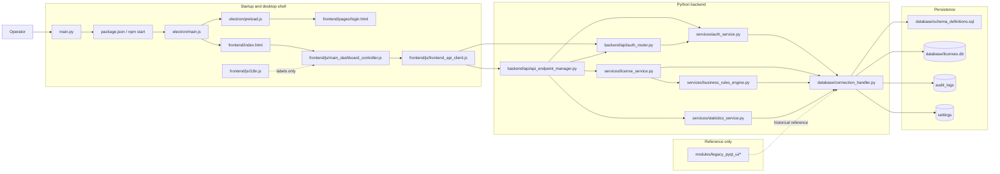
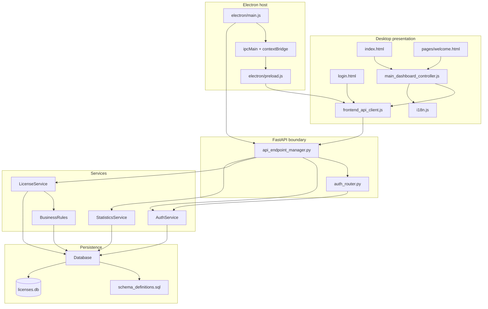
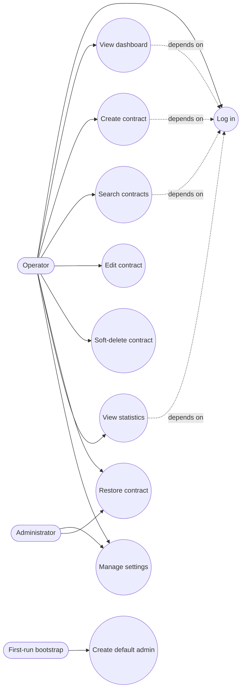
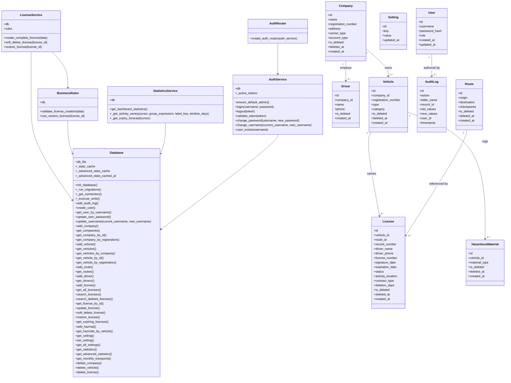

# System Architecture

This repository implements a local desktop administration system, not a web SaaS product. The actual runtime is a small Electron shell that launches a Python FastAPI process, which in turn talks to a single SQLite database file through a thin data-access wrapper. The source code also contains a legacy PyQt UI under `modules/legacy_pyqt_ui`, but that code is retained as reference material rather than part of the active runtime path.

## System Refinements

- `backend/api/auth_router.py` and `services/auth_service.py` provide the login/session flow that is active in the desktop shell.
- `frontend/pages/welcome.html` is a landing screen that sits between login and the main dashboard.
- The Settings page supports account profile security controls (password modification), theme selection, language selectors, and logout. All email and backup controls have been removed.
- `renderDeletedContracts()` and the restore flow are fully integrated, ensuring compliance safety via soft-deletes.
- `main.py` is a thin wrapper that launches `npm start`; it is the user-facing bootstrap entry point.
- **Separated Driver & Vehicle Entities**: Drivers and vehicles are now independent entities with dedicated views. The `drivers` table uses an auto-incrementing system-generated ID with an optional phone field.
- **Segmented Expirations**: Dashboard expiry queries are segmented into 30/60/90 day ranges. Previews are limited to 5 records and filtered entirely on the backend for performance.
- **Settings & Background Jobs Cleanup**: Completely removed SMTP, email notifications, backup systems, database tables (`notifications_log`), and background job managers/threads.

## 1. System Architecture Diagram

### Diagram

### Explanation

- `main.py` exists as the top-level launcher, and `package.json` routes that launch into Electron. If this wrapper were absent, the project would no longer present as a single desktop application entry point.
- `electron/main.js` owns process supervision: it starts Python, polls `/api/ping`, and only then opens the browser window. That startup gate matters because the renderer expects a live API immediately. Without it, the UI would race the backend and fail on first load.
- The renderer side is split into `login.html`, `index.html`, `main_dashboard_controller.js`, `frontend_api_client.js`, and `i18n.js`. Those pieces exist so the UI can be display-only, localized, and decoupled from backend transport details.
- `backend/api/api_endpoint_manager.py` is the HTTP boundary. It receives requests, validates payloads, and delegates work to services instead of mutating the database directly. `auth_router.py` is separate so authentication can be isolated from the rest of the REST surface without circular imports.
- `services/license_service.py` exists because contract creation touches several tables in one unit of work. `services/business_rules_engine.py` exists so those rules can be changed without rewriting endpoints.
- `services/statistics_service.py` exists because dashboard aggregation is read-heavy and benefits from caching. Predefined Sétif commune boundaries are loaded and statistics are aggregated using `licenses.activity_location` strictly aligned against `frontend/data/setif_communes.json`.
- `database/connection_handler.py` exists as the single SQLite access boundary. It owns WAL mode, busy-timeout retries, schema bootstrap, migrations, cache invalidation, and audit logging.
- `database/schema_definitions.sql` exists as the canonical schema source. `database/licenses.db` is the actual local data store.

---

## 2. Component Diagram

### Diagram

### Explanation

- The presentation components keep the desktop shell understandable: `login.html` handles sign-in, `index.html` hosts the authenticated shell, `welcome.html` provides a landing page, `main_dashboard_controller.js` controls navigation and page rendering, `frontend_api_client.js` centralizes HTTP calls, and `i18n.js` manages translated strings.
- `electron/main.js` and `electron/preload.js` form the host boundary. `main.js` starts the backend and supervises readiness; `preload.js` exposes only the minimum bridge needed by the renderer.
- `api_endpoint_manager.py` and `auth_router.py` are the HTTP façade. They exist so the renderer never talks to SQLite directly.
- `AuthService`, `LicenseService`, `BusinessRules`, and `StatisticsService` are separated by responsibility.

---

## 3. Use Case Diagram

### Diagram

### Explanation

- `Operator` is the main human user of the system. The active UI lets that user log in, view the dashboard, create contracts, search records, edit contracts, soft-delete contracts, restore deleted records, and view statistics.
- `Administrator` is a narrower operational role. The settings management and restore operations are restricted or managed by this user.
- `First-run bootstrap` creates a default admin account on first run if no users exist.

---

## 4. Class Diagram

### Diagram

---

## 5. Engineering Analysis & Refactoring Decisions

### Entity Separation (Vehicles, Drivers, and Contracts)
Vehicles, Drivers, and Contracts are now strictly decoupled into distinct views and schemas:
- **Vehicles View**: Displays registration number, type, category, and associated company. No contracts or drivers context is leaked here.
- **Drivers View**: Displays system-generated ID, driver name, optional phone number, and associated company. Drivers are fully independent entities linked to contracts.
- **Contracts View**: Displays license, route, driver name, and vehicle registration.

### Auto-Increment Driver ID Logic
The `drivers` table features a system-generated, auto-incrementing `id` as the primary key. Driver records are synchronized during contract creation or update operations. This auto-incremented primary key ensures drivers remain unique, independent entities, and prevents manual alterations of driver identifiers.

### Optional Phone Field Design Decision
In compliance with data collection guidelines and system flexibility, the driver's phone number is optional (`NULL` allowed). Operators can register drivers with a name and company link without having to supply a contact number.

### Expiration Segmentation Design
To ensure optimal performance and scalability, the "Expiring Contracts" section on the dashboard uses a tabbed switcher for 30, 60, and 90 days:
- Previews are fetched with a backend limit of 5.
- Users can click "View Full List" to load the complete dataset for that range.
- All filtering is executed on the database/backend level via SQL queries, preventing full-dataset load overhead on the client side.

### Removal of Background Services Rationale
All SMTP configurations, test email routines, database backup handlers, and background scheduler threads/job managers have been completely removed. In a local desktop app context:
- External mail/scheduler threads introduce unnecessary complexity, background thread leaks, and socket security risks.
- Removing them reduces resource footprint, improves starting and stopping sequence safety, and avoids security risks associated with storing SMTP credentials locally.

### Indexing Strategy
B-Tree indexes are preserved on critical fields like vehicle registration numbers to guarantee fast, sub-millisecond lookups during search queries and validation checks.

### Username Change & Contact Us Centralization
- **Username Change Flow**: Requires backend verification using the user's current password. Session state (token) is programmatically synchronized to prevent the operator from being signed out during renames. Password confirmation is mandatory to ensure credential owner authorization.
- **Centralized Contact Us Section**: Integrated into the Settings panel as an elegant, interactive card containing mailto links. Placing it here provides the operator with immediate support access and centralizes developer credentials cleanly.
- **Vehicle ID Auto-Increment**: The vehicle `id` field uses a unique system-generated AUTOINCREMENT schema to prevent duplicates, remain stable after deletions, and guarantee long-term integrity of foreign key relations.

---

## 6. References

- [Database Design](database_design.md)
- [System Flows](system_flows.md)
- [Project Structure Guide](project_structure_guide.md)
