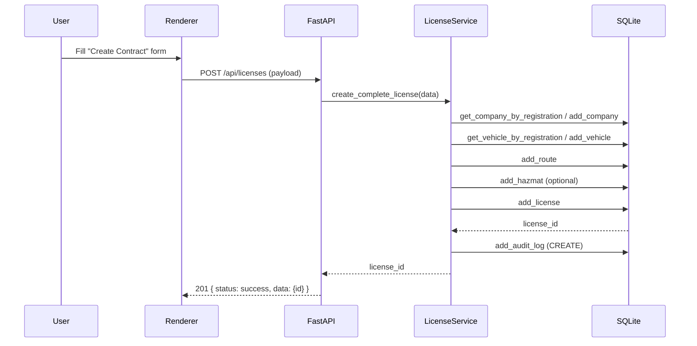
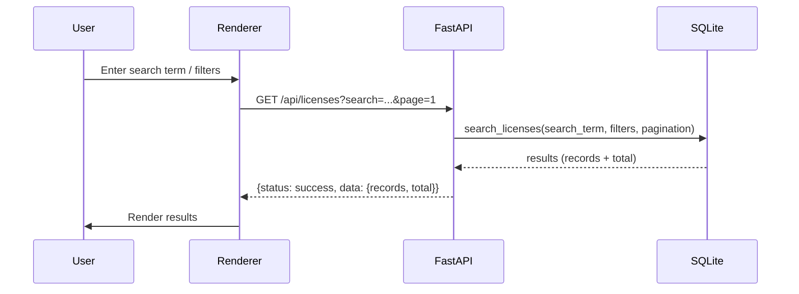
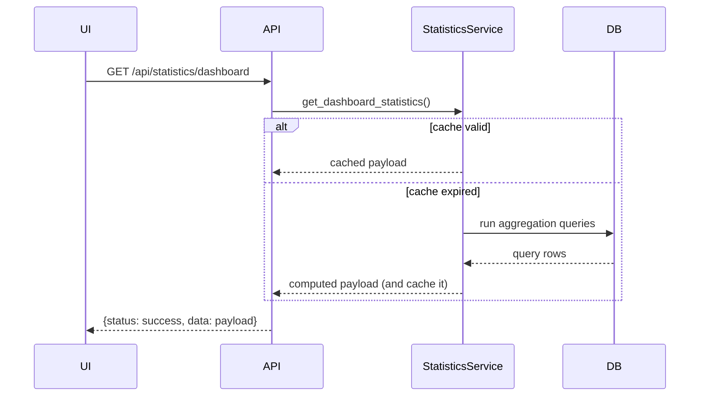

## System Flows and Sequence Diagrams

### Contract Creation

Explanation: The UI posts to the local API which delegates orchestration to `LicenseService`. The service ensures company and vehicle exist (create-if-missing), persists route/hazmat, then the license record, and finally writes an audit log. This centralization prevents inconsistent state across components.

---

### Search Workflow

Explanation: Search requests are implemented by `Database.search_licenses`, which applies SQL filters and pagination. The API returns a consistent envelope (`status/message/data`) so the UI has a single parsing strategy for lists, filters, sorting, and deleted/archived views.

---

### Statistics Workflow

Explanation: `StatisticsService` maintains an in-memory TTL cache to avoid repeated heavy aggregation queries. When cache is valid, responses are instant; when expired, the service runs joins/aggregations, caches results, and returns structured KPI and municipality datasets used by charts.
