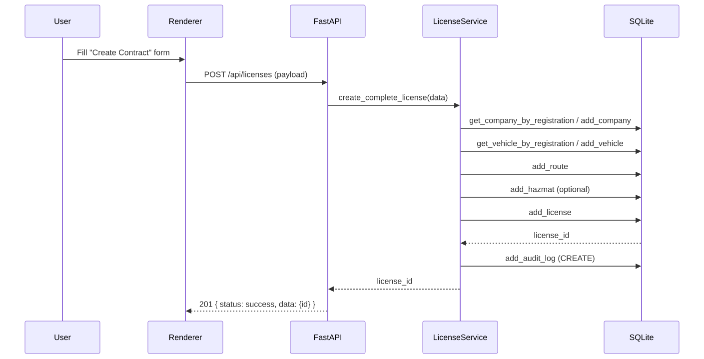
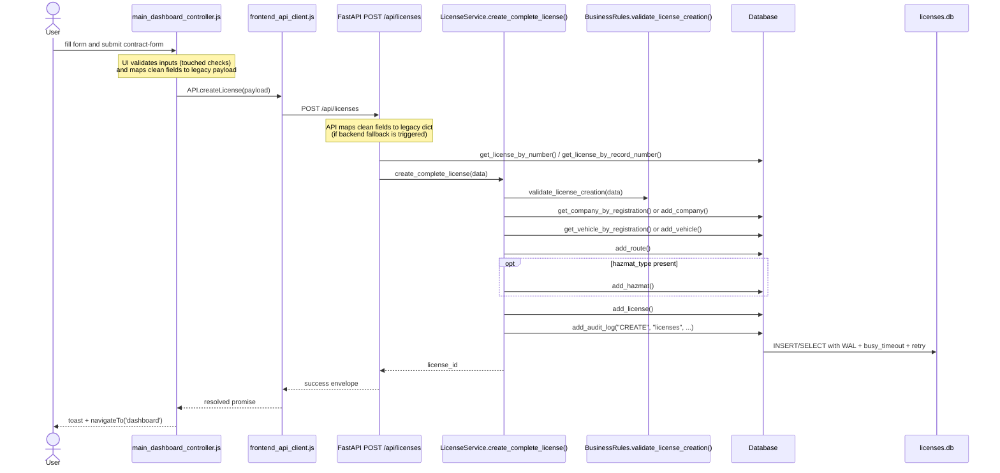
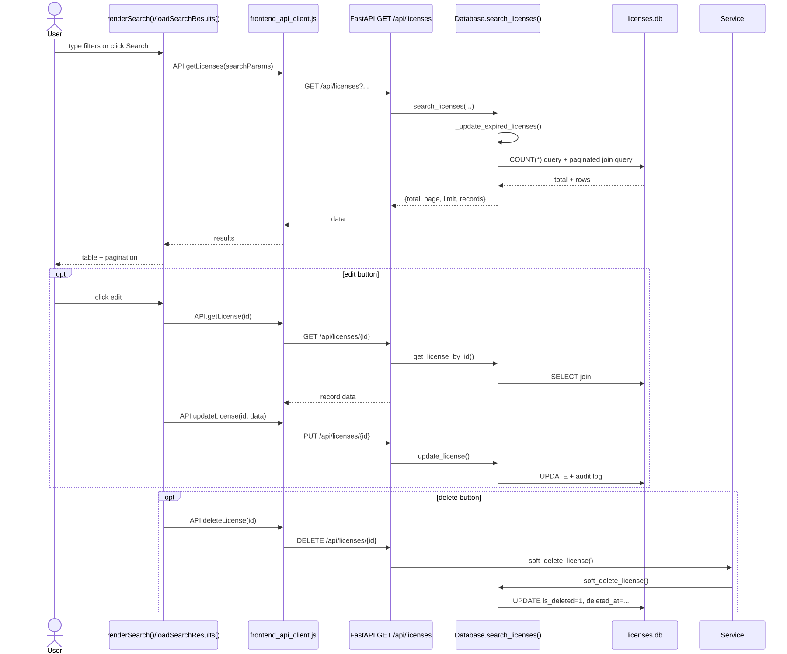
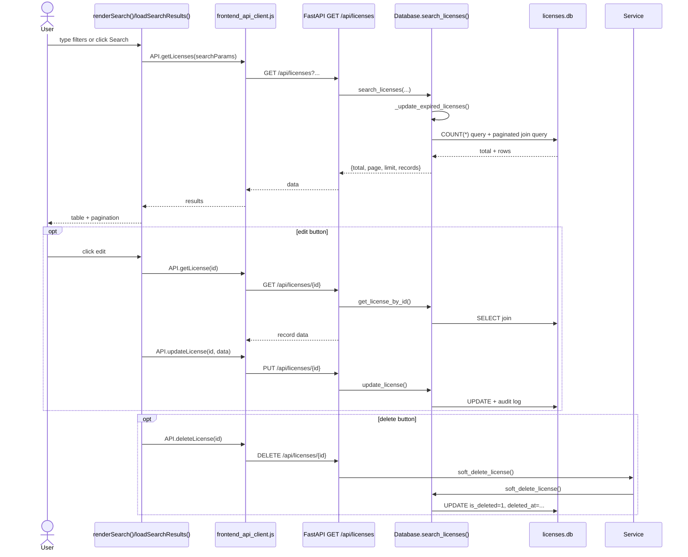
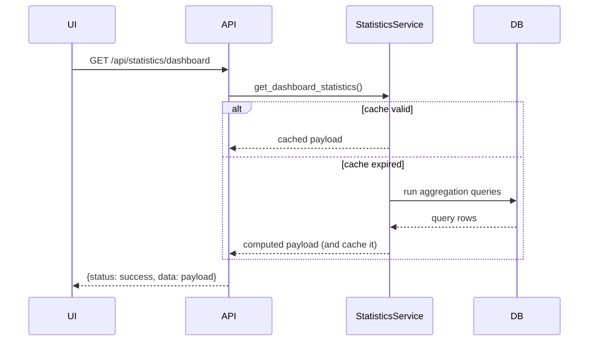
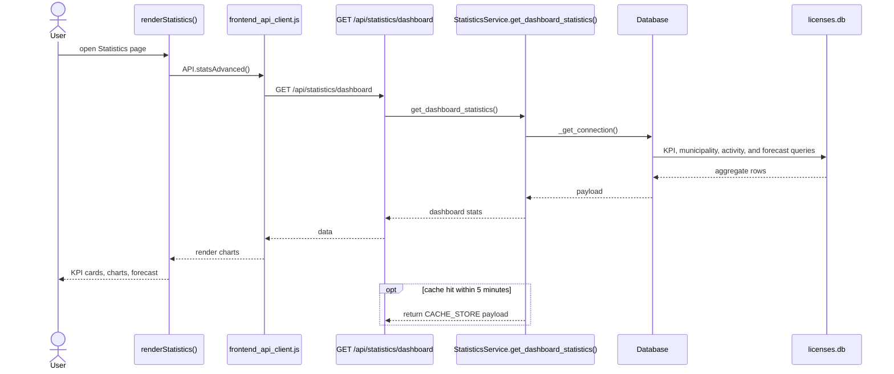

# System Flows

This document traces the actual runtime call sequences for the three highest-value user workflows in the current codebase: contract creation, search, and statistics. The flows are based on `frontend/js/main_dashboard_controller.js`, `frontend/js/frontend_api_client.js`, `backend/api/api_endpoint_manager.py`, `services/license_service.py`, `services/statistics_service.py`, and `database/connection_handler.py`.

## 1. Contract Creation

### Diagram

### Mermaid source

### Explanation

- `main_dashboard_controller.js` owns the form, touched/dirty validation state, and frontend mapping logic. It exists so the operator can enter one complete record in a single pass. If the controller were missing, there would be no frontend orchestration for the contract entry workflow.
- `frontend_api_client.js` exists to keep request construction and response normalization in one place. If contract creation had to be hand-coded in the page, error handling would be duplicated and inconsistent.
- The FastAPI endpoint in `api_endpoint_manager.py` exists to validate the payload boundary and reject obvious duplicates before the deeper workflow runs. That protects the database from unnecessary writes and keeps the UI response shape stable.
- `LicenseService.create_complete_license()` exists because the write is multi-entity. It must validate rules, resolve or create a company, resolve or create a vehicle, create a route, add an optional hazmat row, create the license row, and write the audit log in order. If this orchestration were split across callers, the app would be much easier to break.
- `BusinessRules.validate_license_creation()` exists to enforce domain constraints that are not just schema-level checks. If it were removed, invalid contract data could still reach the database through the API.
- `Database` and `licenses.db` are the persistence boundary. The WAL mode and retry logic are important here because contract creation can overlap with background work such as stats refreshes or backups. If those safeguards did not exist, transient lock errors would show up as user-visible failures.
- The completion step returns a success envelope, which the UI converts into a toast and a dashboard navigation. That is a good fit for a desktop admin app because the user gets immediate feedback and lands back on a high-level overview after the write.

## 2. Search Workflow

### Diagram

### Mermaid source

### Explanation

- `renderSearch()` builds the filter controls and `loadSearchResults()` performs the actual fetch. Those functions exist so search can debounce input and keep the page responsive. Without them, the operator would have to manually refresh the table after every filter change.
- `API.getLicenses(searchParams)` centralizes query-string creation. That matters because the search page has several optional filters and pagination parameters; hand-building them in multiple spots would be error-prone.
- `Database.search_licenses()` exists because search is not a simple table scan. It updates expired statuses first, enforces whitelist sorting, builds a joined query against licenses, vehicles, and companies, and returns a paginated response. If this logic were split up, search results would be much easier to desynchronize.
- The edit branch exists because the search page is not just read-only; it is an operational table. `API.getLicense()` and `API.updateLicense()` reuse the same backend boundary as other contract operations, which keeps the editing path consistent with creation and restore.
- The delete branch uses soft-delete instead of hard delete, which is the same compliance choice reflected in the schema and database wrapper. If that branch hard-deleted rows, the deleted-contracts screen and restore flow would stop working.
- This workflow fits a local desktop admin app because it prioritizes fast filtering, immediate table updates, and low-friction record maintenance rather than remote collaboration.

## 3. Statistics Workflow

### Diagram

### Mermaid source

### Explanation

- `renderStatistics()` exists to destroy any previous Chart.js instances and rebuild the dashboard cleanly. If it did not do that, repeated visits to the page could leak canvas state and produce rendering artifacts.
- `API.statsAdvanced()` is the single call that the page needs because the statistics dashboard wants a combined payload instead of many small requests. That keeps the page fast enough for a desktop operator.
- `StatisticsService.get_dashboard_statistics()` exists to collect all dashboard metrics in one place and cache the result for five minutes. The cache is a deliberate trade-off: it slightly delays fresh numbers but greatly reduces repeat query cost.
- `Database` exists here because the service uses joins and aggregations that are easier to reason about at the data layer than in the renderer. If those queries moved into the UI, the frontend would become bloated and less maintainable.
- The resulting payload feeds KPI cards, municipality distribution charts, activity analysis, and expiry forecasting. This is a good fit for a local desktop admin app because the dashboard is mostly read-heavy and the operator values quick visual feedback more than real-time streaming metrics.

## 4. Notes for Maintainers

- The search and statistics workflows both depend on `Database._update_expired_licenses()`, so regressions there will affect more than one page.
- The contract creation path is the highest-risk write path because it touches several tables in one request.
- If you add new dashboard metrics, prefer extending `StatisticsService` and the existing `GET /api/statistics/dashboard` payload rather than adding multiple ad hoc endpoints.

## 5. References

- [System Architecture](system_architecture.md)
- [Database Design](database_design.md)
- [Project Structure Guide](project_structure_guide.md)
